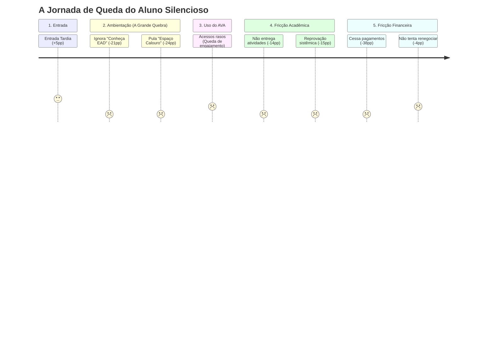

# Análise de Fricções Digitais e Operacionais
**Foco:** Grupo Evasão Silenciosa Potencial vs Ativos Sem Risco

A partir da base de dados (`dataset_aluno_predicted.xlsx`), analisamos o comportamento do grupo de 52.345 alunos classificados como **Evasão Silenciosa Potencial** comparando-os com os alunos **Ativos Sem Risco**. O objetivo é identificar onde a jornada "quebra" antes mesmo de o aluno manifestar o desejo de cancelar o curso.

---

## 1. Ranking das Maiores Fricções (Por Impacto)

Abaixo estão os maiores abismos comportamentais entre um aluno seguro e um aluno em evasão silenciosa:

1. **Fricção Financeira (Falta de Engajamento)**  
   * **Métrica:** Engajamento Financeiro (`PC_ENGAJAMENTO_FINANCEIRO`)
   * **Ativos:** 87,82% | **Silenciosos:** 49,48%
   * **Diferença:** **-38,34 pontos percentuais (pp)**
   * **Diagnóstico:** O aluno silencioso para de pagar as mensalidades muito antes de evadir formalmente.

2. **Falta de Ambientação Básica**  
   * **Métrica:** Realização do Questionário Espaço Calouro (`FL_FEZ_QUEST_ESPACO_CALOURO`)
   * **Ativos:** 36,95% | **Silenciosos:** 12,95%
   * **Diferença:** **-23,99 pp**
   * **Diagnóstico:** A ausência de engajamento no onboarding é um atestado precoce de evasão futura.

3. **Desconexão com a Metodologia (Conheça EAD)**  
   * **Métrica:** Acesso ao módulo Conheça EAD (`FL_ACESSOU_CONHECA_EAD`)
   * **Ativos:** 46,88% | **Silenciosos:** 25,27%
   * **Diferença:** **-21,61 pp**
   * **Diagnóstico:** O aluno silencioso não entende como o ensino digital da Vitru funciona, gerando ansiedade e abandono.

4. **Abandono Acadêmico Prático**  
   * **Métricas:** Entrega de Atividades e Aprovação em Disciplinas
   * **Ativos:** ~20,4% de entrega | **Silenciosos:** ~6,3% de entrega
   * **Diferença:** **-14,0 pp em entregas e -15,9 pp em aprovação**
   * **Diagnóstico:** Sem ambientação e sem engajamento, o aluno zera a interação acadêmica.

---

## 2. Mapa da Jornada: Pontos de Quebra

> [!WARNING]
> **O Ponto de Ruptura:** A jornada não quebra no momento da inadimplência (Etapa 5). A verdadeira raiz da evasão silenciosa acontece na **Etapa 2 (Ambientação)**. O aluno não aprende a estudar no EAD, o que gera a falha acadêmica (Etapa 4) e, consequentemente, a inadimplência (Etapa 5).

---

## 3. Matriz: Fricção → Evidência → Intervenção

| Eixo Analisado | Fricção Identificada | Classificação | Ação/Intervenção Recomendada |
| :--- | :--- | :--- | :--- |
| **Ambientação** | Baixa taxa de acesso ao "Conheça EAD" e "Espaço Calouro" | 🔴 **Evidência Forte** | Disparar réguas de WhatsApp gamificadas na semana 1 cobrando apenas o login na ambientação (intervenção comportamental, não acadêmica). |
| **Fricção Financeira** | Queda abrupta de engajamento financeiro s/ renegociação | 🔴 **Evidência Forte** | O aluno silencioso tem vergonha ou desinteresse em renegociar (apenas 0,22% tenta). A IA deve oferecer renegociação preditiva ativa, sem exigir que o aluno procure o portal. |
| **Fricção Acadêmica** | Taxa de entrega de atividades desaba de 20% para 6% | 🔴 **Evidência Forte** | Monitorar o tempo em tela na semana de entrega de atividade. Se o acesso cair, o tutor humano deve intervir perguntando se há dúvidas metodológicas. |
| **Jornada de Entrada** | Entrada Tardia (Late Enrollment) | 🟡 **Evidência Moderada** | Alunos tardios têm +5% de presença no grupo silencioso. Criar uma "Trilha Express de Aceleração" para o aluno que entra com a turma já rodando. |
| **Uso do AVA** | Baixa usabilidade em Trilhas, Sala Virtual, Calendário e Livros | ⚪ **Lacuna de Dados** | *Não há granularidade na base atual sobre quais botões ou telas do AVA o aluno clica.* É necessário implementar telemetria de front-end para descobrir fricções de UX. |
| **Jornada de Entrada** | Forma de Ingresso / Dias desde Matrícula | ⚪ **Lacuna de Dados** | *Não rastreado na base analítica atual.* Inserir no pipeline de dados futuro. |

---

## 4. Conclusão Executiva (Pitch Argument)

Para a defesa perante a banca:

> *"Nossa análise provou que a inadimplência e a reprovação não são a causa da evasão silenciosa, mas sim o **sintoma final**. O verdadeiro ponto de ruptura acontece na primeira semana: o aluno silencioso engaja **24 pontos percentuais a menos** na etapa de Ambientação. Ele simplesmente não aprende a ser um aluno EAD. Nosso Motor de Intervenção atua exatamente aqui: ele deixa de cobrar o boleto atrasado no mês 3, e passa a intervir na ausência de login no mês 1, salvando não apenas a vida acadêmica do estudante, mas revertendo a perda financeira antes dela se consolidar."*
